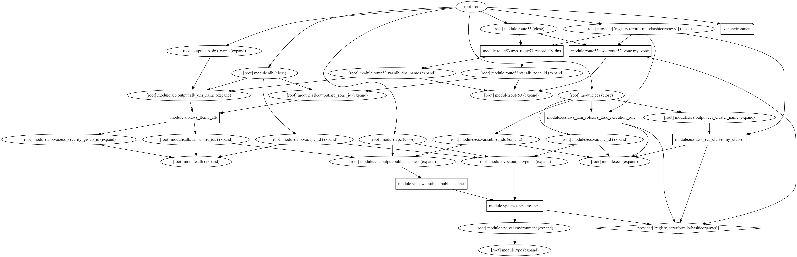

# Infrastructure as Code for AWS

This repository contains Terraform code to deploy basic infrastructure on AWS using Infrastructure as Code (IaC) principles. The infrastructure includes a collection of Java-based microservices communicating through named aliases and DNS namespaces.

## Project Structure

 ```bash

.
├── README.md
├── infrastructure_diagram.png
├── main.tf
├── modules
│   ├── alb
│   │   ├── main.tf
│   │   ├── outputs.tf
│   │   └── variables.tf
│   ├── ecs
│   │   ├── main.tf
│   │   ├── outputs.tf
│   │   └── variables.tf
│   ├── route53
│   │   ├── main.tf
│   │   ├── outputs.tf
│   │   └── variables.tf
│   └── vpc
│       ├── main.tf
│       ├── outputs.tf
│       └── variables.tf
├── outputs.tf
├── provider.tf
└── variables.tf
    
  ```


- **modules/**: Contains subdirectories for each infrastructure component (ALB, ECS, Route 53, VPC).
- **main.tf**: Main Terraform configuration file that instantiates the modules and defines the infrastructure.
- **provider.tf**: Provider configuration file defining the AWS provider.
- **variables.tf**: File to declare input variables used in the Terraform configuration.
- **outputs.tf**: File to define output variables exposed by the Terraform configuration.
- **README.md**: This file, providing an overview of the project.
- **infrastructure_diagram.png**: PNG diagram illustrating the infrastructure architecture.

## Why We Chose Terraform

We chose Terraform as our Infrastructure as Code tool for its declarative approach, which allows us to define our infrastructure in code using a simple and human-readable syntax. Terraform's provider model also enables us to manage resources across various cloud providers and services, providing flexibility and scalability.

## Infrastructure Diagram



The diagram illustrates the basic infrastructure deployed using this Terraform configuration. It includes the Virtual Private Cloud (VPC), Application Load Balancer (ALB), ECS clusters, and Route 53 DNS records.

## Usage

1. Clone the repository:

    ```bash
    git clone https://github.com/Amankesarwani2202/HRS.git
    cd your-repo
    ```

2. Configure your AWS credentials using environment variables or AWS CLI.

3. Initialize Terraform:

    ```bash
    terraform init
    ```

4. Review and adjust variables in `variables.tf` file according to your requirements.

5. Deploy the infrastructure:

    ```bash
    terraform apply
    ```

6. After deployment, Terraform will output relevant information such as DNS names, ALB endpoints, etc.

7. To destroy the infrastructure, run:

    ```bash
    terraform destroy
    ```

## Deploying New Services

Team members can deploy new services by following these steps:

1. Create a new module within the `modules/` directory for the new service.
2. Define the necessary infrastructure components (e.g., ECS task definition, service, etc.) within the new module.
3. Update the main Terraform configuration (`main.tf`) to include the new module.
4. Define any input variables required by the new module in `variables.tf`.
5. Run `terraform init`, `terraform plan`, and `terraform apply` to deploy the new service.


